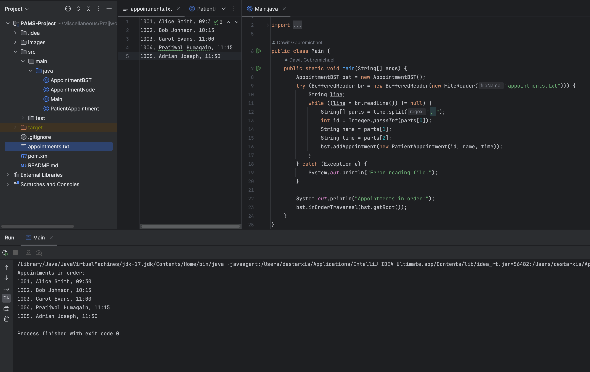
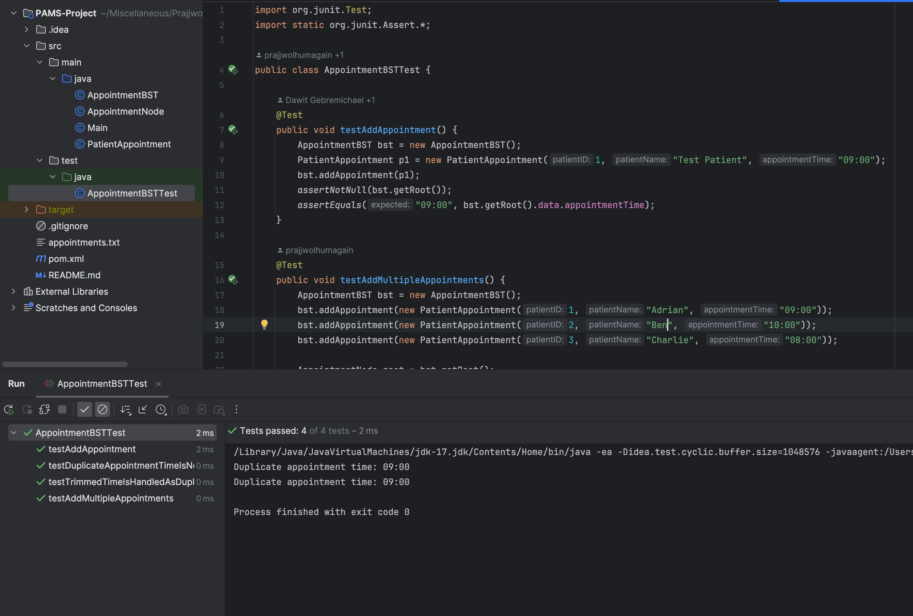

# Patient Appointment Management System (PAMS)

This project implements a basic system using Binary Search Tree (BST) to manage patient appointments.

## Tasks for Students

- [ ] Complete BST insertion logic in `AppointmentBST.java`
- [ ] Prevent duplicate appointment times
- [ ] Write tests in `AppointmentBSTTest.java`
- [ ] Upload runnable screenshot
- [ ] Push to GitHub repo

## Running the App

```sh
mvn compile
mvn exec:java -Dexec.mainClass="Main"
```

## Submission

Fork this repo, complete it, and push to GitHub. Then share your GitHub link.


## Screenshots
1. Running application and viewing the outputs
   


2. Running unit test cases
   

